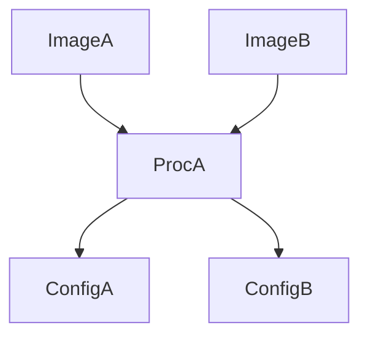

Let's first look at what immutability looks like in software.

##### **Immutable**

{::nomarkdown}





{:/nomarkdown}

Here is an immutable data structure: a tuple. Once created, it can not be modified and therefore the definition is **concrete**. It is this attribute that makes the object hashable. 

##### **Mutable**

{::nomarkdown}





{:/nomarkdown}

Here is a mutable data structure: a pythonic list. The object can be modified at runtime. It is this attribute that makes the object unhashable. There is no reliable value to calculate a hash from the object's definition. (We are going to ignore `def __hash__(self) => id(self)` can be used in python, as `id` is [guaranteed to be unique and constant for this object during its lifetime](https://docs.python.org/3/library/functions.html#id). This goes further into state invariants and compiler theory.)

## Immutability in Infrastructure

According to [CNCF](https://glossary.cncf.io/immutable-infrastructure), immutable infra is **infra that cannot be changed once deployed**. It is a challenging problem, for example with VM deployments, users can add file system mounts and this couldn't be tracked. Now if the VM goes down, restoration is difficult. True [Infrastructure as Code](https://glossary.cncf.io/infrastructure-as-code/) (IaC) largely solves this problem as each "release" (immutable) is tagged with a version (our `hash`) in version control. We can implement IaC by using containerization where each (docker) image has a tag. We need further steps to ensure users can't ssh and make [breaking changes](https://en.wiktionary.org/wiki/breaking_change#:~:text=Noun,code%20used%20by%20multiple%20applications.). Every change must happen through code.

Referring back to immutability in programming, immutability enables *referential transparency* (fxn `y` always returns `z` for input: `x`) as the value the variable `x` refers to never changes. This in turn enables pure functions (*and by extension, functional programming*). 

In IaC, we see that immutable deployments ensure everything is constant for a deployment ***state***. We can refer to this ***state*** by it's release version (or `hash`). Knowing what immutability allows us to do, we can extend beyond just *immutability in infrastruture*. What if we tracked the inputs and outputs for each deployment process? We now enable [local reasoning](https://degoes.net/articles/fp-glossary), where inferring the correctness of the system is not dependent on *prior states* or *all inputs*. This translates to being able to pin down what file is exactly responsible for an issue in your deployment (solving by elimination is now feasible 😧). Tracking inputs in IaC becomes relatively easy when we use config files to store everything, and use tools like [pantsbuild](https://www.pantsbuild.org/) that leverage functional programming standards, transitive dependencees, and such.

### Why?

##### **Simpler and Safer deployments**

Now since every change goes through code, we can incorporate CI/CD pipelines to make changes on the fly. The pipelines become easier to write as we don't need to worry about a global state when building, it's just chained functions: (Config A, B, C -> Proc A -> Artifact A, B -> Proc B -> Image-0.0.1).

There also exist tests in the pipelines to ensure deployment safety. Since we can reason about functions locally and all artifacts used to build the images are *constant*, these tests become very simple to write.

##### **Faster deployments**

As we know all config files are constant and every Process will return `B` for every input `A`, we can share artifacts between different builds. For example:

By caching our output at `Proc A` for inputs (`Config A` and `Config B`), we speed up our deployment builds.

##### **E**

F
