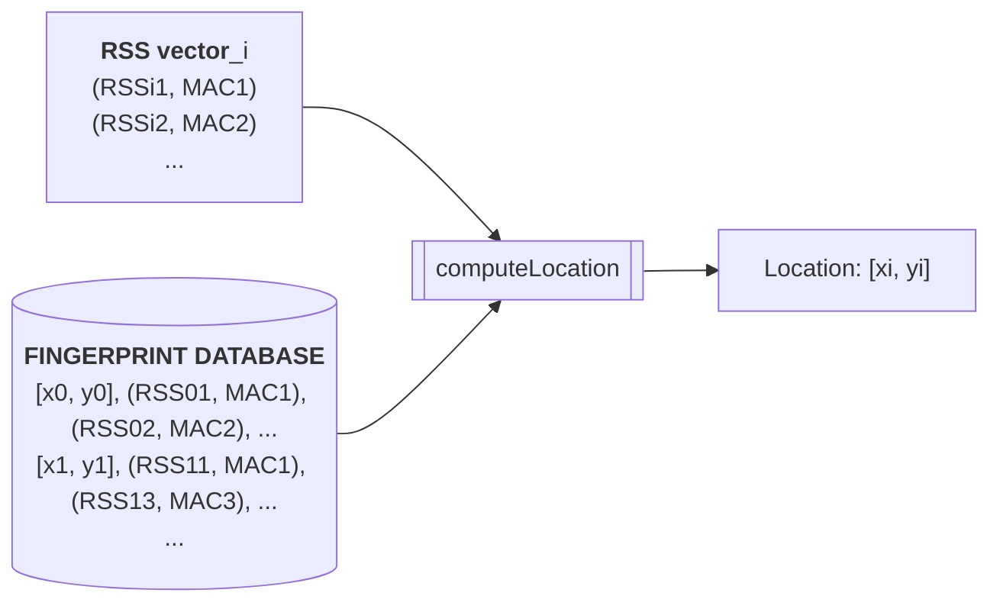

Making a lean inventory tracking system that will improve with technology.

A warehouse operates as a decentralized system with a shared state. Each asset moves inventory independently with a plan agreed upon between all assets. An _asset_ here can be a forklift, pallet jack, etc... There is a lot of active [research](https://uwaterloo.ca/analytics-optimization-lab/projects/adding-data-analytics-warehouse-logistics) going into how to optimize inventory management in these facilities. I will not bore you with collected data and research developments, but will present to you a fun solution to generate the data needed for these optimizations.

How does one start with tracking the inventory? With tracking the assets that move the inventory.

## How do you track location?

This is a geolocation problem. As inventory is commonly stored in indoor spaces, GPS is out the door. A question at the root of designing the positioning system is:

> Should the system track the location of each asset centrally, or should each asset independently determine and report its own location?

**System tracks each asset**

This would be a centralized system tracking the location of each asset in the facility. Example: cameras strategically placed around the warehouse tracking the location of all assets using computer vision. This approach is cumbersome for many reasons including high overhead and vision obstruction, but conveys the notion of a centralized system clearly.

The benefit is that you have a fixed cost which won't scale with your number of assets. Only one "computer" is required to monitor all activities in the warehouse.

**Asset reports to system**

This means assets tracking their own location and reporting it to a centralized system. Example: cameras placed on each asset that decode location by reading barcodes placed around facility.

The benefit here is the reduced complexity as each agent finds their location independently, rather than a central system tracking all states simultaneously and having to differentiate between assets. You have all the other benefits that you get with a decentralized system like fault tolerance (central server goes down), scalability (no central compute contraint except for location ingestion pipeline), etc...

One thing that's not easy to see yet is that it opens up doors to an exciting new-ish tracking method, [WiFi fingerprinting](https://en.wikipedia.org/wiki/Wi-Fi_positioning_system). It is because the asset can track its own location, we can use this method.

---

**Asset reports to system** is chosen as the winner. The incurred overhead is worth it, because it enables a) a decentralized system, and b) location triangulation using signal strengths.

Let's take a step back here, and see what options we have to implement a decentralized tracking system?

1.  Cameras placed on each asset to read barcodes placed around facility

Camera feed processing will require compute power on each asset incurring overhead, and barcode maintenance and obstruction is concerning as well. This solution is not feasible.

2. RFID/Bluetooth antennas placed on each asset that scan RFID/BLE "checkpoints" scattered around facility to determine asset location.

Minimal compute required on assets, but process of placing RFID tags around facility is not easily scalable and requires ovehead on both the facility and asset side to work.

3. WiFi antennas placed on each asset to measure signal strength to existing routers in facility which will determine location of asset, using WiFi fingerprinting.

This solution solves problems with previous solutions, as it scales with WiFi routers and is cheap to implement on forklifts with a simple [ESP32](https://en.wikipedia.org/wiki/ESP32) microcontroller on them. The drawback here is lower precision, dependent on factors like humidity. Considering how WiFi fingerprinting is an emerging technology, the research here will only make this solution better to implement in the future years.

### WiFi fingerprinting

Each asset will measure received signal strength (RSS) to all access points (APs), which will be a vector mapping from AP MAC addresses to RSS values. This RSS vector will be sent into a generalized pipeline for computing asset location. The pipeline also requires RSS values from predetermined reference points for comparison, which are stored in the "fingerprint database". Here is a flowchart of the pipeline:



What's to be noted here is that choosing the location of reference points (RPs) is tricky. Wifi signal attenuates exponentially with distance, which means RPs need to placed with non-linear spacing to get a good coverage of RSS values in the facility. There will also be walls and obstructions which will bounce signals creating multiple spots with similar RSS values. Here, the multiple APs will help in triangulating asset location. RPs should be placed further from APs, so that the reduced gradient in RSS values near an AP over distance is avoided. These observations were captured in a simulation using the [path lass model](https://en.wikipedia.org/wiki/Path_loss):

<figure>
    
</figure>

The `computeLocation` function in the above flowchart will apply a K-Nearest-Neighbors algorithm to compute location of the asset. Here is some pseudocode:

```python
def computeLocation(
    observedRss: List[ Tuple[ int, str ] ],
    fingerprintDB: List[ Tuple[
        # Location, RSS vector
        Tuple[ float, float ], List[ Tuple[ int, str ] ] ] ]
) -> Tuple[ float, float ]:
    # For each point in the database:
    #     a. Calculate Euclidean and Manhattan distance between observed RSS values and db entry.
    #     c. Store the distances along with the coordinates in a list.

    # Sort list of distances by Euclidean, using Manhattan to break ties.

    # Select K closest points from the sorted list.

    # Take weighted average of coordinates of K closest points, using inverse of distance as weight
    #     If any points have 0 distance, assign infinite weight to that point

    # return the weighted average of [ x, y ] as location of asset
```

As previously discussed, WiFi fingerprinting will be less precise due to environmental factors. We can either use sensors to record these factors and input them into the RSS vectors for computing location. But a more static way of tackling this is to have less granular tracking using zoning in the warehouse. Exact dropoff and pickup points will already be stored in the inventory management software. With wider zones and recorded flow of traffic, we would have enough logging to apply meaningful optimizations to inventory management in the facility with little overhead

## How do you track inventory?

Now that we know the location of the asset, how do we know what inventory is on the asset?

For this, the most cost-effective solution is to use RFID tags on each item in the warehouse. The asset will have an RFID reader that will scan the items on it and report it to the centralized system. The system will then update the inventory database with the new location of the item.

The tricky part here is to know when an item is removed or added to the asset. A weight sensor can be used to determine if an item is added or removed from the asset, in addition to what is scanned by the RFID reader. If the overhead is a concern, we can ensure that an asset is scanned for a certain time before we consider the scan as a removal or addition.
